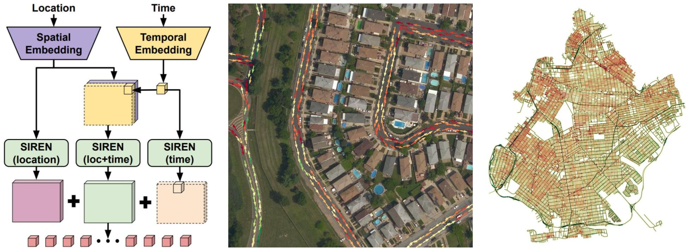

<div align="center">
  <h1> Probabilistic Image-Driven Traffic <br/> Modeling via Remote Sensing </h1>
  
  [](https://arxiv.org/abs/2403.05521)
  [](https://www.scottworkman.com/research/motion/)</center>
    
  [Scott Workman](https://scottworkman.com/) and 
  [Armin Hadzic](https://www.arminhadzic.com/), ECCV 2024

</div>

[](https://www.scottworkman.com/research/motion/)

## Table of Contents

- [Table of Contents](#table-of-contents)
- [Get Started](#get-started)
  - [Installation](#installation)
  - [Download Weights](#download-weights)
  - [Train and Evaluate](#train-and-evaluate)
- [Dynamic Traffic Speeds++ Dataset](#dynamic-traffic-speeds-dataset)
  - [Dense Variant of DTS++](#dense-variant-of-dts)
  - [Download](#download)
- [Publications](publications)
- [License](#license)

## Get started

### Installation

1. Clone the repository.
```bash
git clone https://github.com/scottworkman/image-driven
cd image-driven
```

2. Create and activate the environment (e.g., using [conda](https://github.com/conda-forge/miniforge)).

```bash
conda env create -f resources/environment.yml
conda activate image-driven
```

### Download Weights

We release several models to enable training and evaluating our methods. To use them with the scripts in this repo, create a top-level `logs/` directory and extract the archives inside.

| Model | Description | Link                           
-|-|-
Ours | Model from our ECCV 2024 paper. | [model.zip](https://drive.google.com/file/d/1-SheCk6_ndW_I2NBN0v-06HgIFESEPN3/view?usp=drive_link)
Pretrain | Weights used to initialize the image backbone during training. | [pretrain.zip](https://drive.google.com/file/d/1PbQWywOuB54ZXs3i5WB3AunGpSsL38KF/view?usp=sharing)                       

### Train and Evaluate

To train our approach:
```bash
python main.py --pretrain="./logs/pretrain.ckpt"
```

To train other variants of our approach, as described in the paper, adjust the input arguments:
```bash
python main.py --help
```
For example:
```bash
python main.py --method=metadata
```

To evaluate:
```bash
cd eval
python compute_speed_metrics.py
```

For visualizing results, see the example notebooks in the visualize subdirectory.

## Dynamic Traffic Speeds++ Dataset

Our dataset can be obtained using the links below. The scripts in this repository asume the dataset lives at `dts++/` under the root directory. Extract the dataset wherever you like and then create a symbolic link:

```bash
ln -s /path/to/dataset dts++
```

Disclaimer: The overhead imagery is owned and copyrighted by Microsoft and must not be used for any commercial purposes.

### Dense Variant of DTS++

The original version of [DTS](https://arxiv.org/abs/2012.10530) introduced the notion of sampling to enable angle-dependent traffic speed prediction. We trained and evaluated our approach following the same methodology (i.e., using a precomputed set of sparse points). However, we also release a new dense variant of DTS++, which completely removes the notion of sampling as well as provides new dense angle masks. 

Note that evaluating our method (trained sparsely) in a dense manner, i.e., aggregating over all road segment pixels, achieves similar performance:

```bash
python compute_speed_metrics.py --dense=True
```

For ease of use, we suggest that follow-on work build from the dense variant of DTS++. 

### Download

- [DTS++](https://drive.google.com/file/d/1s99G8MQyN6jg6tRYX8v3sezLeZmNTXtn/view?usp=sharing)
- [DTS++ (Dense)](https://drive.google.com/file/d/1MeGitCbeMYqFlkQG9mEL7gJ88ICM3sf2/view?usp=sharing)

## Publications

Please cite our paper if you find this work helpful:
```bibtex
@inproceedings{workman2024probabilistic,
  title={{Probabilistic Image-Driven Traffic Modeling via Remote Sensing}},
  author={Scott Workman and Armin Hadzic},
  booktitle={{European Conference on Computer Vision (ECCV)}},
  year=2024
}
```

This project builds on our prior work:
```bibtex
@inproceedings{workman2020dynamic,
  author={Scott Workman and Nathan Jacobs},
  title={{Dynamic Traffic Modeling from Overhead Imagery}},
  booktitle={{IEEE Conference on Computer Vision and Pattern Recognition (CVPR)}},
  year=2020,
}
```

## License

The code is distributed under the CC BY-NC-SA 4.0 License.
See [LICENSE](LICENSE) for more information.

```python
# Copyright © Scott Workman. 2024. All rights reserved.
# Licensed under CC BY-NC-SA 4.0 (non-commercial use only).
```
